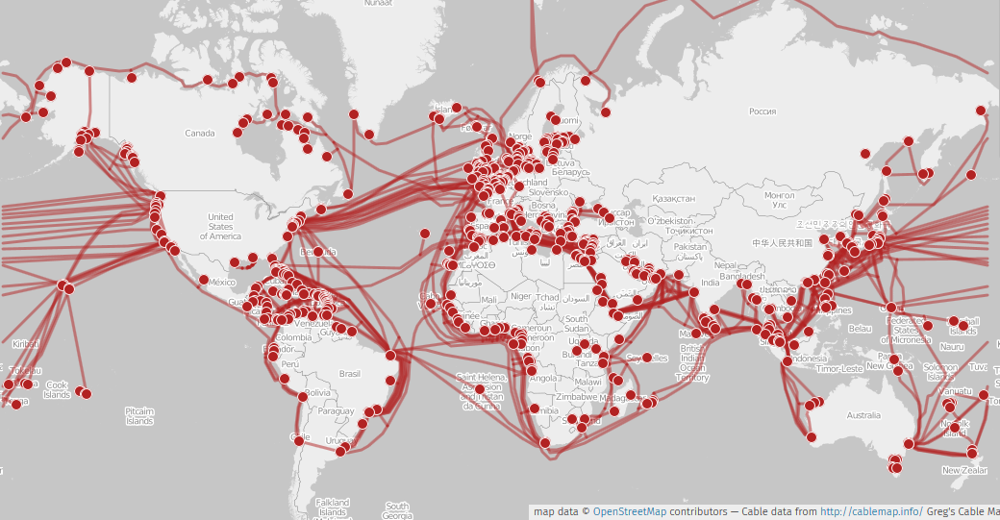

In order to address the critical lack of data on the dynamics and physical evolution of the seafloor (coastal erosion, tectonic or volcanic motions, gravitational instabilities, etc.), we are exploring the potential of [Distributed Fiber-Optic Sensing](https://en.wikipedia.org/wiki/Fiber_optic_sensor) (DFOS) technology to complement or improve existing seafloor monitoring techniques.

DFOS is a revolutionary technique allowing to quantify deformation, temperature and/or acoustic signals typically every few meter of a standard optic fiber cable and over distances of several tenths of kilometers. The physical principle is not new but decades of improvements in the price and performance of the components make it a potential affordable alternative to standard seafloor instrumentation. Compared to traditional electro-mechanical sensors, optical fibers have many advantages: they are passive, lightweight, small, immune to electromagnetic interferences and tolerant to harsh environments (temperature and pressure). Data acquisition is done at the speed of light allowing any new application to become an operational system, and allowing the development of new early-warning systems. With DAS group at the Géoazur lab, we are especially focused on a particular DFOS technology call Distributed Acoustic Sensing (DAS).

There are two main strategies to harness the potential of DFOS, either through the deployment of a dedicated cable, or the use of cables in place:

### Existing fiber optic cables

Thanks to the telecom industry, the seafloors are already largely covered with fiber optic cables. The challenge here is to define the potential of these large infrastructures to provide meaningful geophysical signals measurements despite not being optimized for that.

Our first steps into the realm of seafloor fiber seismo-acoustic sensing, unveiling the potential of the approach to monitor earthquakes, swell, microseism...

* Sladen, A., Rivet, D., Ampuero, J. P., De Barros, L., Hello, Y., Calbris, G., & Lamare, P. (2019). Distributed sensing of earthquakes and ocean-solid Earth interactions on seafloor telecom cables. [Nature communications](https://www.nature.com/articles/s41467-019-13793-z), 10(1), 5777. 

**Imagery of the subsurface** and of resonant modes in sedimentary basins:

* Lior, I., Mercerat, E. D., Rivet, D., Sladen, A., & Ampuero, J. P. (2022). Imaging an underwater basin and its resonance modes using optical fiber distributed acoustic sensing. [Seismological Research Letters](https://pubs.geoscienceworld.org/ssa/srl/article-abstract/93/3/1573/612878), 93(3), 1573-1584. [Pre-print](https://hal.science/hal-03452259/)

**Earthquake detection** and potential of the approach for early-warning:

* Lior, I., Sladen, A., Rivet, D., Ampuero, J. P., Hello, Y., Becerril, C., ... & Markou, C. (2021). On the detection capabilities of underwater distributed acoustic sensing. [Journal of Geophysical Research: Solid Earth](https://agupubs.onlinelibrary.wiley.com/doi/abs/10.1029/2020jb020925), 126(3), e2020JB020925. 

* Lior, I., Sladen, A., Mercerat, D., Ampuero, J. P., Rivet, D., & Sambolian, S. (2021). Strain to ground motion conversion of distributed acoustic sensing data for earthquake magnitude and stress drop determination. [Solid Earth](https://se.copernicus.org/articles/12/1421/2021/), 12(6), 1421-1442.

* Lior, I., Rivet, D., Ampuero, J. P., Sladen, A., Barrientos, S., Sánchez-Olavarría, R., ... & Bustamante Prado, J. A. (2023). Magnitude estimation and ground motion prediction to harness fiber optic distributed acoustic sensing for earthquake early warning. [Scientific Reports](https://www.nature.com/articles/s41598-023-27444-3), 13(1), 424.

**Physical oceanography** including microseismic noise generation, seafloor currents and thermometry:

* Guerin, G., Rivet, D., van den Ende, M. P. A., Stutzmann, E., Sladen, A., & Ampuero, J. P. (2022). Quantifying microseismic noise generation from coastal reflection of gravity waves recorded by seafloor DAS. [Geophysical Journal International](https://academic.oup.com/gji/article-abstract/231/1/394/6595879), 231(1), 394-407. [(Pre-print)](https://www.researchgate.net/profile/Gauthier-Guerin/publication/361005807_Quantifying_microseismic_noise_generation_from_coastal_reflection_of_gravity_waves_recorded_by_seafloor_DAS/links/62b5ca15dc817901fc78f521/Quantifying-microseismic-noise-generation-from-coastal-reflection-of-gravity-waves-recorded-by-seafloor-DAS.pdf)

* Flores, D. M., Sladen, A., Ampuero, J. P., Mercerat, E. D., & Rivet, D. (2022). Monitoring Deep Sea Currents with Seafloor Distributed Acoustic Sensing. [(Authorea Preprint)](https://www.authorea.com/doi/full/10.1002/essoar.10512729.1)

* Quiñones, J. P., Sladen, A., Ponte, A., Lior, I., Ampuero, J. P., Rivet, D., ... & Coyle, P. (2022). High resolution seafloor thermometry and internal wave monitoring using Distributed Acoustic Sensing. [(Authorea Preprints)](https://quarxiv.authorea.com/doi/full/10.1002/essoar.10512858.1) 

### Dedicated fiber optic cables

In many cases, places of geophysical interest might not be covered with optical fiber cables. The thick armored cables used by the telecom industry are too expensive for academic applications. Instead, we are developing a lightweight plow to trench thin fiber optic cables inside the sediments of the seafloor. Trenching the cable allows to improve the coupling and protect the thin cable from fishing activities. Our plow system was first tested and validated in 2018 offshore the Nice airport, France. The first deployment of fiber optic cables is scheduled in the same area in 2019. The area offshore the Nice airport is both a convenient local test site but also an area of great scientific and societal interest: the seafloor shows many signs of fluid seepage and the steep slopes might be prone to destabilization; in 1979, a submarine landslide triggered a [local tsunami](https://en.wikipedia.org/wiki/1979_nice_tsunami).

