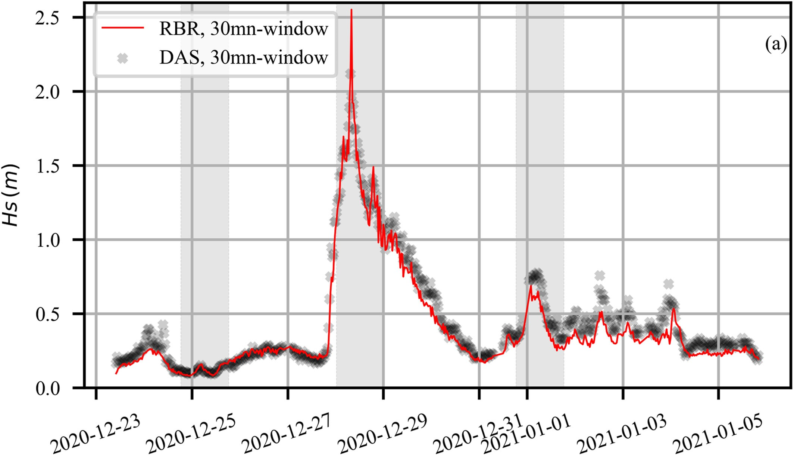
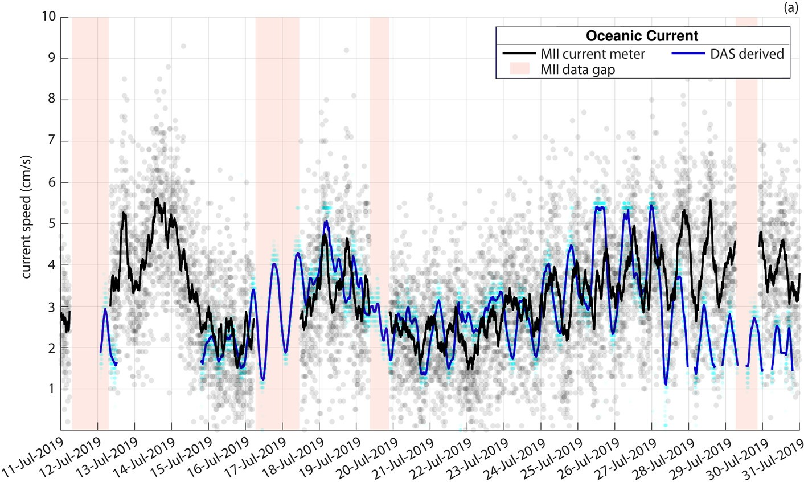

Seafloor telecommunication cables can be turned into dense arrays of environmental sensors using Distributed Acoustic Sensing (DAS). This project highlights recent work on using these underwater fiber optic cables for high-resolution ocean monitoring, including measuring temperature changes and reconstructing wave heights. This new technology provides unique observations and insight into the physical processes at play in the ocean, with the additional benefit of being able to monitor oceanographic variables in real time.

## Seafloor Thermometry

We have demonstrated that DAS can be used for high-resolution seafloor thermometry: up to mK variations over tens of kilometers with virtual sensors every few meters. This allows for monitoring of internal waves and upwelling events with unprecedented detail.

*   Pelaez Quiñones, J. D., Sladen, A., et al. (2023). [High resolution seafloor thermometry for internal wave and upwelling monitoring using Distributed Acoustic Sensing](https://www.nature.com/articles/s41598-023-44635-0). Scientific Reports.

## Wave Height Reconstruction

This work demonstrates a method to reconstruct nearshore wave heights from the strain data recorded by seafloor cables, providing valuable data for coastal hazard assessment, oceanographic studies, and realtime marine weather monitoring.

*   Meulé, S., Pelaez‐quiñones, J., Bouchette, F., Sladen, A., Ponte, A., Maier, A., ... & Coyle, P. (2024). [Reconstruction of Nearshore Surface Gravity Wave Heights From Distributed Acoustic Sensing Data](https://agupubs.onlinelibrary.wiley.com/doi/abs/10.1029/2024EA003589). Earth and Space Science

## Deep Sea Current Monitoring

By analyzing the vibrations of the cable itself, we can also monitor the speed of deep sea currents flowing over the seafloor cable. These results were validated against a current meter at the end of the cable.

*   Mata Flores, D., Sladen, A., Ampuero, J. P., Mercerat, E. D., & Rivet, D. (2023). [Monitoring deep sea currents with seafloor distributed acoustic sensing](https://agupubs.onlinelibrary.wiley.com/doi/abs/10.1029/2022EA002723). Earth and Space Science, 10(6), e2022EA002723.

*   Mata Flores, D., Mercerat, E. D., Ampuero, J. P., Rivet, D., & Sladen, A. (2023). [Identification of two vibration regimes of underwater fibre optic cables by distributed acoustic sensing](https://academic.oup.com/gji/article-abstract/234/2/1389/7091916). Geophysical Journal International, 234(2), 1389-1400.

## Microseismic Noise Generation

The interaction of ocean gravity waves with the coast generates a continuous seismic hum known as microseismic noise. We use DAS recordings on seafloor cables to quantify this noise generation process and better understand the coupling between the ocean and the solid Earth. The amount of energy reflected at the coast can be used to improve ocean circulation models.

*   Guerin, G., Rivet, D., van den Ende, M. P. A., Stutzmann, E., Sladen, A., & Ampuero, J. P. (2022). [Quantifying microseismic noise generation from coastal reflection of gravity waves recorded by seafloor DAS](https://academic.oup.com/gji/article-abstract/231/1/394/6595879). Geophysical Journal International, 231(1), 394-407. [(Pre-print)](https://www.researchgate.net/profile/Gauthier-Guerin/publication/361005807_Quantifying_microseismic_noise_generation_from_coastal_reflection_of_gravity_waves_recorded_by_seafloor_DAS/links/62b5ca15dc817901fc78f521/Quantifying-microseismic-noise-generation-from-coastal-reflection-of-gravity-waves-recorded-by-seafloor-DAS.pdf)
