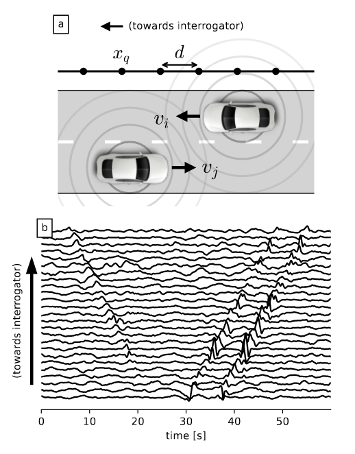

Distributed Acoustic Sensing (DAS) is a revolutionary photonic technology allowing to convert existing fiber optic cables into dense arrays of seismo-acoustic sensors. In pratice, this means sensors every few meters over tens of kilometers with only one instrument to deploy: the DAS interrogator at one end of the fiber. Sensors can be really sensitive (nanometric deformation of the fiber) enabling the detection of nearby trains, cars, cyclists, pedestrians... And data is acquired at the speed of light enabling live monitoring of the heart beat of cities. However, this great sensing power comes at a cost: terabytes of data to process. Also, the fiber optic cables are not optimally deployed meaning that the data can be noisy and contain many overlapping signals. To overcome these challenges and develop new applications, we develop advanced algorithms capable to retrieve valuable metrics (number of cars, type of vehicule, traffic speed...)  with meter-scale precision, in real time, and even in complex configuration (high traffic density).

The research group includes:

* [Cédric Richard](http://www.cedric-richard.fr/), professor in signal processing at University Côte d'Azur and holder of a dedicated [3IA chair](https://3ia.univ-cotedazur.eu/research/chair-holder-cedric-richard)

* [André Ferrari](https://andferrari.github.io/), professor in signal processing at University Côte d'Azur,

* [Martijn van den Ende](https://www.martijnvandenende.nl/), former postdoctoral fellow in the project,

This project is supported by the [3IA Côte d'Azur](https://3ia.univ-cotedazur.eu/) insititute for artificial intelligence and benefits from a collaboration with the Métropole Nice Côte d'Azur [(MNCA)](https://www.nicecotedazur.org/).

## DAS data denoising 

* van den Ende, M., Lior, I., Ampuero, J. P., Sladen, A., Ferrari, A., & Richard, C. (2021). A self-supervised deep learning approach for blind denoising and waveform coherence enhancement in distributed acoustic sensing data. [IEEE Transactions on Neural Networks and Learning Systems](https://ieeexplore.ieee.org/abstract/document/9655039/). [(Pre-print)](https://hal.science/hal-03347303/document).

## Road traffic monitoring

* van den Ende, M., Ferrari, A., Sladen, A., & Richard, C. (2022). Deep Deconvolution for Traffic Analysis with Distributed Acoustic Sensing Data. [IEEE Transactions on Intelligent Transportation Systems](https://ieeexplore.ieee.org/abstract/document/9966323/).[(Pre-print)](https://scholar.archive.org/work/3sblqnvvprbptkrg7hevw5aa74/access/wayback/https://eartharxiv.org/repository/object/2713/download/5525/)

* Khacef, Y., van den Ende, M., Ferrari, A., Richard, C., & Sladen, A. (2022, October). Self-Supervised Velocity Field Learning for High-Resolution Traffic Monitoring with Distributed Acoustic Sensing. In 2022 [56th Asilomar Conference on Signals, Systems, and Computers (pp. 790-794), IEEE](https://ieeexplore.ieee.org/abstract/document/10051959/). [(Pre-print)](http://www.cedric-richard.fr/Articles/khacef2022self.pdf)

* Khacef, Y., van den Ende, M., Richard, C., Ferrari, A., & Sladen, A. (2025). Precision Traffic Monitoring: Leveraging Distributed Acoustic Sensing and Deep Neural Networks. [IEEE Transactions on Intelligent Transportation Systems](https://ieeexplore.ieee.org/abstract/document/10960439/). [(Pre-print)](https://hal.science/hal-04632372/).
